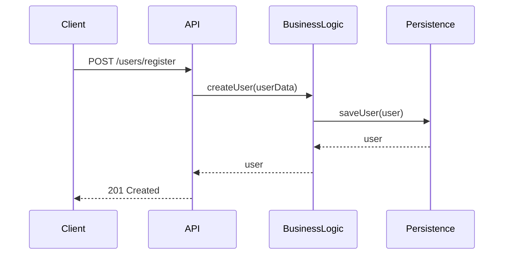
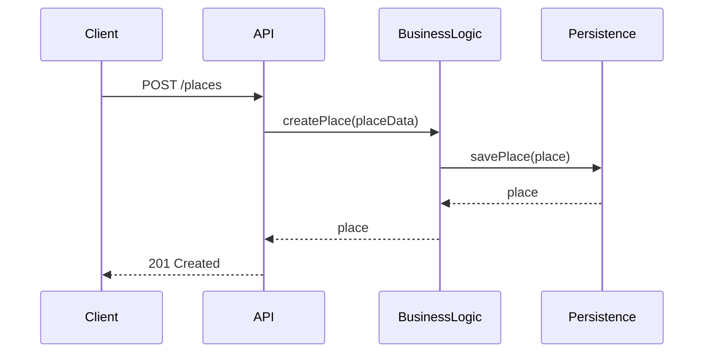
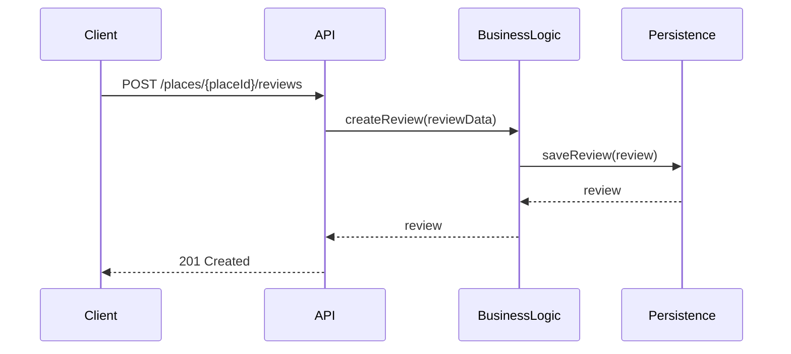
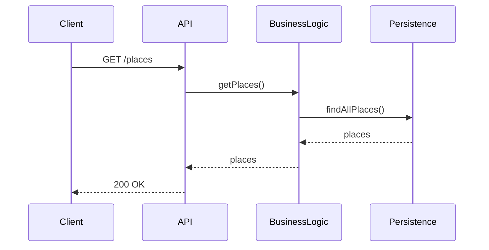

# HBnB Evolution - Part 1: Technical Documentation

## Table of Contents
1. [Project Overview](#project-overview)
2. [Architecture](#architecture)
3. [Business Logic Layer](#business-logic-layer)
4. [API Sequence Diagrams](#api-sequence-diagrams)
5. [Entity Details](#entity-details)
6. [Technical Requirements](#technical-requirements)

## Project Overview

HBnB Evolution is a simplified version of an AirBnB-like application that allows users to manage properties, reviews, and amenities. The application is designed with a three-layer architecture to ensure separation of concerns and maintainability.

### Core Features
- User Management (registration, profile updates, admin roles)
- Place Management (property listings with details)
- Review Management (user reviews and ratings)
- Amenity Management (property features and facilities)

## Architecture

The application follows a three-layer architecture:

### 1. Presentation Layer
- Handles user interactions
- Provides API endpoints
- Manages request/response formatting
- Implements facade pattern for simplified access to business logic

### 2. Business Logic Layer
- Contains core application logic
- Implements business rules
- Manages entity relationships
- Handles data validation

### 3. Persistence Layer
- Manages data storage and retrieval
- Implements database operations
- Handles data consistency

## Business Logic Layer

### Entity Relationships

#### User Entity
- Attributes:
  - id (UUID)
  - first_name (String)
  - last_name (String)
  - email (String)
  - password (String, hashed)
  - is_admin (Boolean)
  - created_at (DateTime)
  - updated_at (DateTime)
- Relationships:
  - One-to-Many with Place (owns)
  - One-to-Many with Review (writes)

#### Place Entity
- Attributes:
  - id (UUID)
  - title (String)
  - description (String)
  - price (Float)
  - latitude (Float)
  - longitude (Float)
  - created_at (DateTime)
  - updated_at (DateTime)
- Relationships:
  - Many-to-One with User (owner)
  - Many-to-Many with Amenity
  - One-to-Many with Review

#### Review Entity
- Attributes:
  - id (UUID)
  - rating (Integer)
  - comment (String)
  - created_at (DateTime)
  - updated_at (DateTime)
- Relationships:
  - Many-to-One with User (author)
  - Many-to-One with Place

#### Amenity Entity
- Attributes:
  - id (UUID)
  - name (String)
  - description (String)
  - created_at (DateTime)
  - updated_at (DateTime)
- Relationships:
  - Many-to-Many with Place

## API Sequence Diagrams

### 1. User Registration

### 2. Place Creation

### 3. Review Submission

### 4. Fetch Places List

## Entity Details

### User Management
- Registration requires email, password, first name, and last name
- Email must be unique
- Password must be hashed before storage
- Admin status can only be set by existing admins

### Place Management
- Places must have valid coordinates
- Price must be positive
- Title and description are required
- Only the owner can modify or delete a place

### Review Management
- Rating must be between 1 and 5
- Users can only review places they've visited
- Users cannot review their own places
- Reviews can be updated or deleted by the author

### Amenity Management
- Amenity names must be unique
- Amenities can be associated with multiple places
- Only admins can create or delete amenities

## Technical Requirements

### Database Requirements
- All entities must have unique UUID identifiers
- Creation and update timestamps must be maintained
- Relationships must be properly indexed
- Data integrity constraints must be enforced

### API Requirements
- RESTful endpoints following standard conventions
- Proper HTTP status codes
- Input validation
- Error handling
- Authentication and authorization

### Security Requirements
- Password hashing
- Input sanitization
- Role-based access control
- API rate limiting
- Data encryption in transit

### Performance Requirements
- Efficient database queries
- Proper indexing
- Caching where appropriate
- Pagination for list endpoints

## Next Steps
1. Implementation of the database schema
2. Development of the business logic layer
3. Creation of the API endpoints
4. Implementation of authentication and authorization
5. Testing and validation 