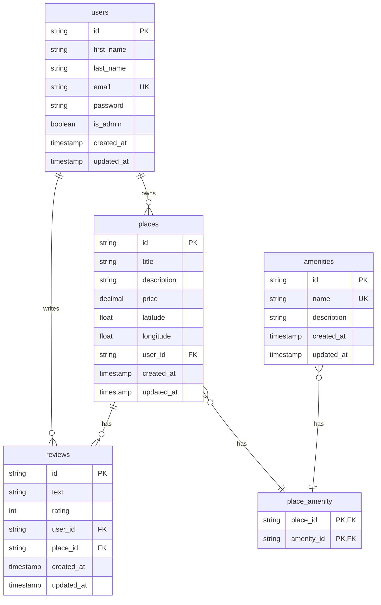

## Relationship Explanations

1. **User to Place (One-to-Many)**
   - A user can own multiple places
   - Each place belongs to exactly one user
   - Represented by `users ||--o{ places`

2. **User to Review (One-to-Many)**
   - A user can write multiple reviews
   - Each review is written by exactly one user
   - Represented by `users ||--o{ reviews`

3. **Place to Review (One-to-Many)**
   - A place can have multiple reviews
   - Each review is for exactly one place
   - Represented by `places ||--o{ reviews`

4. **Place to Amenity (Many-to-Many)**
   - A place can have multiple amenities
   - An amenity can be in multiple places
   - Uses the `place_amenity` junction table
   - Represented by `places }o--|| place_amenity` and `amenities }o--|| place_amenity`

## Key Constraints

1. **Primary Keys (PK)**
   - All tables use UUID (CHAR(36)) as primary key
   - `place_amenity` uses a composite primary key

2. **Foreign Keys (FK)**
   - `places.user_id` references `users.id`
   - `reviews.user_id` references `users.id`
   - `reviews.place_id` references `places.id`
   - `place_amenity.place_id` references `places.id`
   - `place_amenity.amenity_id` references `amenities.id`

3. **Unique Constraints (UK)**
   - `users.email` must be unique
   - `amenities.name` must be unique
   - `reviews` has a unique constraint on `(user_id, place_id)`

4. **Other Constraints**
   - `reviews.rating` must be between 1 and 5
   - Most fields are NOT NULL
   - Timestamps are automatically managed 